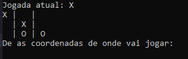

# 🎮 Jogo da Velha em C

Um jogo da velha (tic-tac-toe) para terminal, desenvolvido em C puro, com foco em boas práticas de validação de entrada e organização de código.



## 📋 Sobre o projeto

Projeto desenvolvido para praticar conceitos fundamentais de C: matrizes, funções, ponteiros e, principalmente, tratamento robusto de entrada de usuário. O jogo é totalmente jogável via terminal, com dois jogadores no mesmo dispositivo.

## ✨ Funcionalidades

- Tabuleiro 3x3 interativo, jogado por dois jogadores (X e O)
- Validação de símbolo escolhido no início do jogo
- Validação de coordenadas em três camadas: leitura correta, limites do tabuleiro e posição já ocupada
- Detecção de vitória em linhas, colunas e nas duas diagonais
- Detecção de empate quando o tabuleiro enche sem vencedor
- Mensagens de erro claras, com pausa para o jogador ler antes de continuar

## 🛠️ Tecnologias

- Linguagem C (padrão C99 ou superior)
- Bibliotecas padrão: `stdio.h`, `stdlib.h`

## 🚀 Como compilar e rodar

### Pré-requisitos
Um compilador C instalado (GCC, por exemplo).

### Compilando

```bash
gcc -Wall -Wextra -o jogo_da_velha jogo_da_velha.c
```

### Rodando

**Windows:**
```bash
jogo_da_velha.exe
```

**Linux/Mac:**
```bash
./jogo_da_velha
```

## 🎲 Como jogar

1. Ao iniciar, escolha seu símbolo: `X` ou `O`
2. Os jogadores se revezam informando as coordenadas da jogada no formato `linha coluna` (de 0 a 2), separadas por espaço

   Exemplo: para jogar no centro do tabuleiro, digite `1 1`

3. O tabuleiro é exibido a cada rodada, e o jogo avisa automaticamente quando há um vencedor ou empate

## 🧠 Decisões técnicas

Alguns pontos do desenvolvimento que valem destacar:

- **Diagonais sem loops aninhados**: a verificação das diagonais usa os índices `matriz[i][i]` (diagonal principal) e `matriz[i][N-1-i]` (diagonal secundária), evitando a necessidade de dois `for` aninhados.
- **Validação de entrada em camadas**: cada jogada passa por três checagens em sequência — se o `scanf` leu os valores corretamente, se as coordenadas estão dentro do tabuleiro e se a posição já está ocupada.
- **Buffer de entrada centralizado**: uma função `pausar()` cuida de limpar qualquer resíduo no buffer de entrada (do C) antes de esperar a confirmação do jogador, evitando que mensagens de erro sejam puladas.
- **Retorno direto do vencedor**: a função de verificação de vitória retorna o símbolo vencedor (`char`) diretamente, em vez de usar parâmetro por referência, deixando o código mais legível.

## 📁 Estrutura do código

O código é organizado em funções com responsabilidades bem definidas:

| Função | Responsabilidade |
|---|---|
| `esvaziar_matriz` | Inicializa o tabuleiro vazio |
| `mostrar_matriz` | Exibe o tabuleiro no terminal |
| `preenche_matriz` | Controla o loop principal do jogo (jogadas, validações, turnos) |
| `verifica_matriz` | Verifica linhas, colunas e diagonais em busca de um vencedor |
| `tabuleiro_cheio` | Verifica se o tabuleiro está cheio (condição de empate) |
| `limpar_tela` | Limpa o terminal (compatível com Windows e Linux/Mac) |

## 📝 Possíveis melhorias futuras

- [ ] Modo contra o computador (IA simples)
- [ ] Interface gráfica
- [ ] Placar entre partidas
- [ ] Suporte a tabuleiros de tamanhos diferentes

## 👤 Autor

Desenvolvido por Paulo

---

Sinta-se à vontade para abrir issues ou sugerir melhorias!
